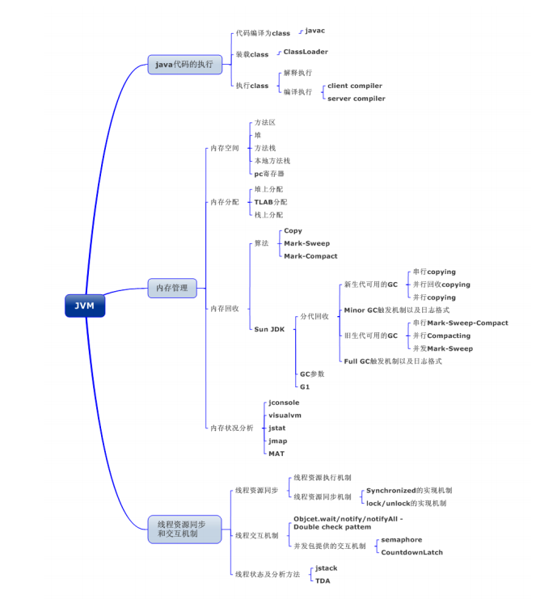
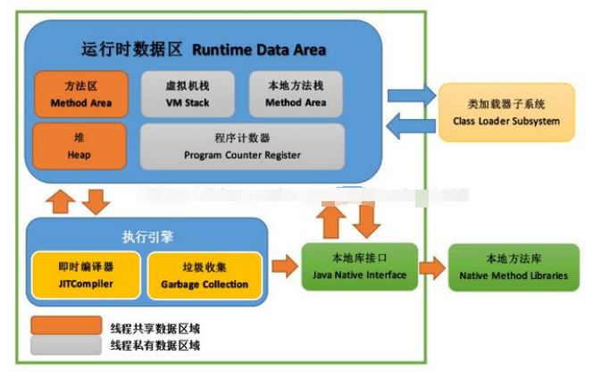
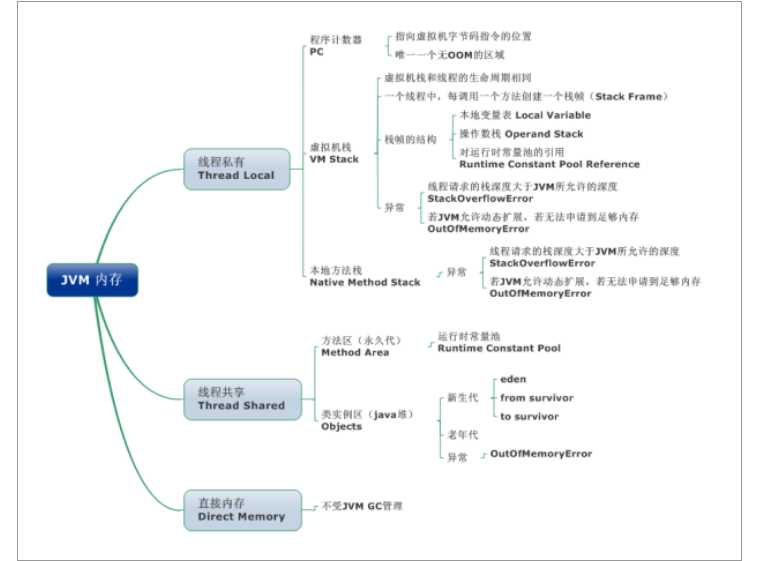
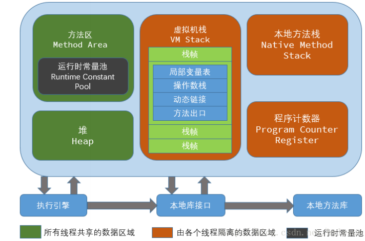
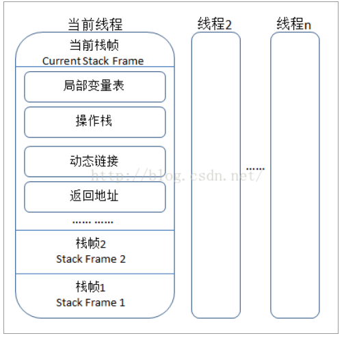
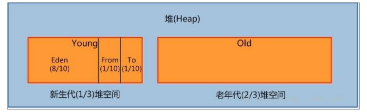

### JVM
JVM 是可运行 Java 代码的假想计算机 ，包括一套字节码指令集、一组寄存器、一个栈、
一个垃圾回收，堆 和 一个存储方法域。JVM 是运行在操作系统之上的，它与硬件没有直接
的交互。

1. JAVA应用执行过程
    - Java源文件 -> 解释器（javac） -> 字节码文件
    - 字节码文件 -> JVM -> 机器码

2. 线程
    
    这里所说的线程指程序执行过程中的一个线程实体。JVM 允许一个应用并发执行多个线程。`Hotspot JVM 中的 Java 线程与原生操作系统线程有直接的映射关系。当线程本地存储、缓冲区分配、同步对象、栈、程序计数器等准备好以后，就会创建一个操作系统原生线程。Java 线程结束，原生线程随之被回收。操作系统负责调度所有线程，并把它们分配到任何可用的 CPU 上。当原生线程初始化完毕，就会调用 Java 线程的 run() 方法。当线程结束时，会释放原生线程和 Java 线程的所有资源。`
    
    - `虚拟机线程（VM Thread）`：这个线程等待 JVM 到达安全点操作出现。这些操作必须要在独立的线程里执行，因为当堆修改无法进行时，线程都需要 JVM 位于安全点。这些操作的类型有：stop-theworld 垃圾回收、线程栈 dump、线程暂停、线程偏向锁（biased locking）解除。 
    - `周期性任务线程`：这线程负责定时器事件（也就是中断），用来调度周期性操作的执行。
    - `GC 线程`：这些线程支持 JVM 中不同的垃圾回收活动。
    - `编译器线程`：这些线程在运行时将字节码动态编译成本地平台相关的机器码。
    - `信号分发线程`：这个线程接收发送到 JVM 的信号并调用适当的 JVM 方法处理。

    - `JVM内存区域`主要分为线程私有区域【程序计数器、虚拟机栈、本地方法区】、线程共享区域【JAVA 堆、方法区】、直接内存。线程私有数据区域生命周期与线程相同, 依赖用户线程的启动/结束 而 创建/销毁(在 Hotspot VM 内, 每个线程都与操作系统的本地线程直接映射, 因此这部分内存区域的存/否跟随本地线程的生/死对应)。
    - `线程共享区域随虚拟机的启动/关闭而创建/销毁。`
    - `直接内存`并不是 JVM 运行时数据区的一部分, 但也会被频繁的使用: 在 JDK 1.4 引入的 NIO 提供了基于 Channel 与 Buffer 的 IO 方式, 它可以使用 Native 函数库直接分配堆外内存, 然后使用DirectByteBuffer 对象作为这块内存的引用进行操作(详见: Java I/O 扩展), 这样就避免了在 Java堆和 Native 堆中来回复制数据, 因此在一些场景中可以显著提高性能。

        - 程序计数器（线程私有）
            - 一块较小的内存空间, 是当前线程所执行的字节码的行号指示器，每条线程都要有一个独立的程序计数器，这类内存也称为“线程私有”的内存。正在执行 java 方法的话，计数器记录的是虚拟机字节码指令的地址（当前指令的地址）。如果还是 Native 方法，则为空。这个内存区域是唯一一个在虚拟机中没有规定任何 OutOfMemoryError 情况的区域。
        - 虚拟机栈（线程私有）
            - 是描述java方法执行的内存模型，每个方法在执行的同时都会创建一个栈帧（Stack Frame）用于存储局部变量表、操作数栈、动态链接、方法出口等信息。每一个方法从调用直至执行完成的过程，就对应着一个栈帧在虚拟机栈中入栈到出栈的过程。栈帧（ Frame）是用来存储数据和部分过程结果的数据结构，同时也被用来处理动态链接(Dynamic Linking)、 方法返回值和异常分派（ Dispatch Exception）。栈帧随建，随着方法结束而销毁——无论方法是正常完成还是异常完成（抛出了在方法内未被捕获的异常）都算作方法结束。

        - 本地方法区（线程私有）
            本地方法区和 Java Stack 作用类似, 区别是虚拟机栈为执行 Java 方法服务, 而本地方法栈则为Native 方法服务, 如果一个 VM 实现使用 C-linkage 模型来支持 Native 调用, 那么该栈将会是一个C 栈，但 HotSpot VM 直接就把本地方法栈和虚拟机栈合二为一。
        - 堆（Heap-线程共享）-运行时数据
            是被线程共享的一块内存区域，创建的对象和数组都保存在 Java 堆内存中，也是垃圾收集器进行垃圾收集的最重要的内存区域。由于现代 VM 采用分代收集算法, 因此 Java 堆从 GC 的角度还可以细分为: 新生代(Eden 区、From Survivor 区和 To Survivor 区)和老年代。
        - 方法区/永久代（线程共享）
            即我们常说的永久代(Permanent Generation), 用于存储被 JVM 加载的类信息、常量、静
            态变量、即时编译器编译后的代码等数据. HotSpot VM把GC分代收集扩展至方法区, 即使用Java堆的永久代来实现方法区, 这样 HotSpot 的垃圾收集器就可以像管理 Java 堆一样管理这部分内存, 而不必为方法区开发专门的内存管理器(永久带的内存回收的主要目标是针对常量池的回收和类型的卸载, 因此收益一般很小)。
3. JVM运行时内存
    - 新生代（Eden，ServivorFrom，S1）
        - 是用来存放新生的对象。一般占据堆的 1/3 空间。由于频繁创建对象，所以新生代会频繁触发MinorGC 进行垃圾回收。新生代又分为 Eden 区，ServivorFrom、ServivorTo 三个区。
        - Eden 区
            - Java 新对象的出生地（如果新创建的对象占用内存很大，则直接分配到老年代）。当 Eden 区内存不够的时候就会触发 MinorGC，对新生代区进行一次垃圾回收。
        - ServivorFrom
            - 上一次 GC 的幸存者，作为这一次 GC 的被扫描者。
        - ServivorTo
            - 保留了一次 MinorGC 过程中的幸存者。
        - `MinorGC 的过程（复制->清空->互换）；MinorGC 采用复制算法`
            1. eden、servicorFrom 复制到 ServicorTo，年龄+1
                首先，把 Eden 和 ServivorFrom 区域中存活的对象复制到 ServicorTo 区域（如果有对象的年
                龄以及达到了老年的标准，则赋值到老年代区），同时把这些对象的年龄+1（如果 ServicorTo 不
                够位置了就放到老年区）；
            2. 清空 eden、servicorFrom
                然后，清空 Eden 和 ServicorFrom 中的对象；
            3. ServicorTo 和 ServicorFrom 互换
                最后，ServicorTo 和 ServicorFrom 互换，原 ServicorTo 成为下一次 GC 时的 ServicorFrom区。
    - 老年代
        - 主要存放应用程序中生命周期长的内存对象。
            老年代的对象比较稳定，所以 MajorGC 不会频繁执行。在进行 MajorGC 前一般都先进行
            了一次 MinorGC，使得有新生代的对象晋身入老年代，导致空间不够用时才触发。当无法找到足
            够大的连续空间分配给新创建的较大对象时也会提前触发一次 MajorGC 进行垃圾回收腾出空间。
            MajorGC 采用标记清除算法：首先扫描一次所有老年代，标记出存活的对象，然后回收没
            有标记的对象。MajorGC 的耗时比较长，因为要扫描再回收。MajorGC 会产生内存碎片，为了减
            少内存损耗，我们一般需要进行合并或者标记出来方便下次直接分配。当老年代也满了装不下的
            时候，就会抛出 OOM（Out of Memory）异常。
    - 永久代
        - 指内存的永久保存区域，主要存放 Class 和 Meta（元数据）的信息,Class 在被加载的时候被放入永久区域，它和和存放实例的区域不同,GC 不会在主程序运行期对永久区域进行清理。所以这也导致了永久代的区域会随着加载的 Class 的增多而胀满，最终抛出 OOM 异常。
        - `JAVA8 与元数据`
        在 Java8 中，永久代已经被移除，被一个称为“元数据区”（元空间）的区域所取代。元空间的本质和永久代类似，元空间与永久代之间最大的区别在于：元空间并不在虚拟机中，而是使用本地内存。因此，默认情况下，元空间的大小仅受本地内存限制。类的元数据放入 native memory, 字符串池和类的静态变量放入 java 堆中，这样可以加载多少类的元数据就不再由MaxPermSize 控制, 而由系统的实际可用空间来控制。

{{ page.date | date_to_string }}
